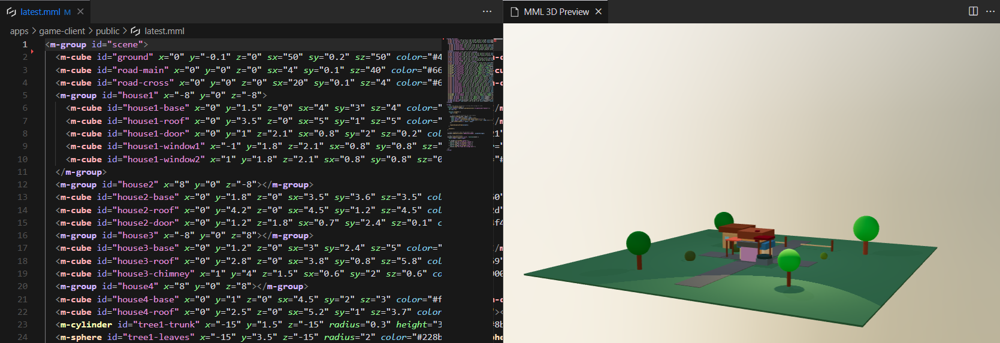

# MML Extension for VS Code

A VS Code extension for [MML (Metaverse Markup Language)](https://mml.io) files with:
- Syntax highlighting for MML elements and attributes
- Auto-completion for attributes
- Basic syntax validation
- **Real-time 3D preview** of MML scenes
- JavaScript syntax highlighting within `<script>` tags
- **Automatic pastel color highlighting** that works with any theme



## Installation

1. Open VS Code extensions
2. Search for "MML"
3. Install the extension

The extension automatically provides beautiful pastel syntax highlighting for MML elements that seamlessly integrates with your existing VS Code theme. No configuration needed!

## Features

### Real-time 3D Preview

The extension now includes a **real-time 3D preview** feature that lets you see your MML scenes as you code:

- **Live preview**: See your 3D scene update in real-time as you type
- **Automatic validation**: Preview only updates when your MML is syntactically correct
- **Side-by-side editing**: Preview opens alongside your code editor
- **Easy access**: Available via command palette, right-click menu, or keyboard shortcut

#### How to use the 3D Preview:

1. **Command Palette**: Press `Ctrl+Shift+P` (or `Cmd+Shift+P` on Mac) and search for "MML: Open 3D Preview"
2. **Right-click menu**: Right-click in any MML file and select "Open 3D Preview"
3. **Keyboard shortcut**: Press `Ctrl+Shift+V` (or `Cmd+Shift+V` on Mac) while editing an MML file
4. **Editor toolbar**: Click the preview icon in the editor toolbar when viewing an MML file

The preview will automatically update whenever you make changes to your MML file, but only if the syntax is valid. This helps you catch errors quickly while providing immediate visual feedback for your 3D scenes.

### Automatic Syntax Highlighting

The extension provides:
- **Pastel colors** for different MML element types (cube, sphere, cylinder, etc.)
- **Colored attributes** grouped by category (position, appearance, interaction)
- **Seamless integration** with any VS Code theme - no need to switch themes
- **No interference** with other file types

### Manual Theme Customization

If you want to customize the MML colors beyond the defaults, you can override them by adding these rules to your VS Code settings (`settings.json`):

```json
{
  "editor.tokenColorCustomizations": {
    "textMateRules": [
      {
        "scope": "entity.name.tag.mml.cube",
        "settings": {
          "foreground": "#FFB3BA",
          "fontStyle": "bold"
        }
      },
      {
        "scope": "entity.name.tag.mml.sphere", 
        "settings": {
          "foreground": "#FFDFBA",
          "fontStyle": "bold"
        }
      },
      {
        "scope": "entity.name.tag.mml.cylinder",
        "settings": {
          "foreground": "#FFFFBA", 
          "fontStyle": "bold"
        }
      },
      {
        "scope": "entity.name.tag.mml.plane",
        "settings": {
          "foreground": "#BAFFC9",
          "fontStyle": "bold"
        }
      },
      {
        "scope": "entity.name.tag.mml.model",
        "settings": {
          "foreground": "#BAE1FF",
          "fontStyle": "bold"  
        }
      },
      {
        "scope": "entity.name.tag.mml.character",
        "settings": {
          "foreground": "#C9BAFF",
          "fontStyle": "bold"
        }
      },
      {
        "scope": "entity.name.tag.mml.media",
        "settings": {
          "foreground": "#FFBAC9", 
          "fontStyle": "bold"
        }
      },
      {
        "scope": "entity.name.tag.mml.utility",
        "settings": {
          "foreground": "#D4BAFF",
          "fontStyle": "bold"
        }
      },
      {
        "scope": "entity.other.attribute-name.mml.position",
        "settings": {
          "foreground": "#98FB98",
          "fontStyle": "italic"
        }
      },
      {
        "scope": "entity.other.attribute-name.mml.appearance", 
        "settings": {
          "foreground": "#87CEEB",
          "fontStyle": "italic"
        }
      },
      {
        "scope": "entity.other.attribute-name.mml.interaction",
        "settings": {
          "foreground": "#DDA0DD",
          "fontStyle": "italic"
        }
      }
    ]
  }
}
```

## Development

```bash
npm install
npm run build
```

Press `F5` to run the extension in a new VS Code window.

## Links

- [MML Website](https://mml.io)
- [Docs](https://mml.io/docs)
- [GitHub](https://github.com/mml-io/mml)

## License

MIT 